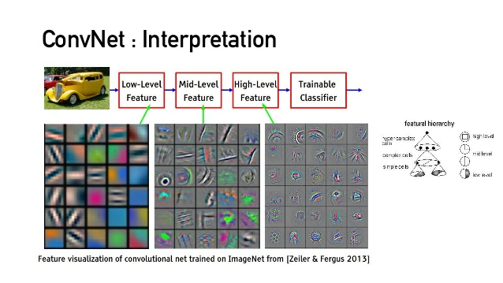

# CNN4Vision [2]

## Loss function and optimization

**A loss function tells how good our current classifer is. - 损失函数用于评估参数的好坏（其实一般是评价这个参数有多坏）**

Given a dataset of examples, $x_i$ is the image, $y_i$ is (integer) label:
$$
\{(x_i,y_i)\}_{i=1}^N
$$
then the loss function is something like below:
$$
L=\frac{1}{N}\sum_i L_i(f(x_i, W), y_i)
$$

### Multiclass SVM loss


多分类支持向量机的损失函数如下式所示，$s_j$表示第$j$类的分数，$s_{y_i}$表示正确分类对应的分数。其含义为正确分类的分数应该要远高于错误分类的分数（体现为$s_{y_i} \ge 1 + s_j$），如果低于这个限度（margin），则需要进行惩罚。
$$
L_i = \sum_{j\neq y_i}\max(0, s_j - s_{y_i} + 1)
$$
如下图所示，多分类支持向量机的损失函数可以认为是一个**合页损失（hinge loss）**，具体可以参考李航《统计学习方法》中有关支持向量机的内容


而对于初始化的参数，我们一般会采用一些接近于0的较小的数值，即$s\approx 0$

###  Regularization

在机器学习中，当多个函数都能较好的拟合数据的时候，倾向于选择更加简单的模型（参考奥卡姆剃刀原则），因此通常会在损失函数后添加一个正则项对函数的复杂性进行惩罚。
$$
L(W)=\frac{1}{N}\sum_{i=1}^N L_i(f(x_i, W), y_i) + \lambda R(W)
$$


#### commonly used regularizations

1. L2 regularization: $R(W)=\sum_k\sum_l W_{k,l}^2$ - tend to drive weights to 0
2. L1 regularization: $R(W)=\sum_k\sum_l|W_{k,l}|$ - consider the number of 0s in weights
3. Elastic net (L1 + L2): $R(W)=\sum_k\sum_l\beta W_{k,l}^2+|W_{k,l}|$
4. Max norm regularization
5. Dropout
6. Fancier - batch normalization, stochastic depth

### Softmax Classifier (Multinomial Logistic Regression)

$$
P(Y=k|X=x_i)=\frac{e^{z_k}}{\sum_j e^{z_j}}, z=f(x_i;W)
$$

softmax的损失函数如下，本来我们应该是最大化$\log P$，但是由于损失函数是度量坏的程度，因此在这里取负数
$$
L_i = -\log P(Y=k|X=x_i)=-\log\left(\frac{e^{z_k}}{\sum_j e^{z_j}}\right)
$$
对于分类正确的值，其分数$z\ (0\le z\le 1)$应该非常接近于1，因此会有较小的损失，而若分类错误，则会更靠近0，这会导致较大的损失。


## Optimization

### Strategy #1 Random Search

随机采样寻找最佳的参数，这显然是比较蠢:pig:的方法，而且耗费时间和计算资源。

### Strategy #2 Follow the slope

显然，要从山上到山谷的最快方法就是走坡度最大的路线，在求取参数的过程中，这种路线在一维的情况表现为其导数
$$
\frac{df(x)}{dx}=\lim_{h\rightarrow 0}\frac{f(x+h) - f(x)}{h}
$$
而在多维度的情况下则表现为梯度（gradient）$\nabla_W L$

### Gradient Check

使用数值梯度检验解析梯度（损失函数梯度的解析式）

### Strategy #3 Vanilla Gradient Descent (SGD)

```python
while True:
  weights_grad = evaluate_gradient(loss_fun, data, weights)
  weights += - step_size * weights_grad
```

其中，step_size又称为learning_rate（学习率），其可以调整参数更新的速度，对于优化结果具有较大的影响，若学习率过小，则可能优化过程速度过慢，若学习率过大，则可能一直到不了最优的参数。


### Strategy #4 Stochastic Gradient Descent (SGD)

通常训练数据集非常大（可能有十几万行），假如采用上述的策略进行梯度下降将会花费非常多的时间，一个比较好的策略是使用minibatch，每次从训练中取样（数量通常为$2^n$个），然后进行参数的更新。

```python
while True:
  data_batch = sample_training_data(data, 256)
  weights_grad = evaluate_gradient(loss_fun, data_batch, weights)
  weights += - step_size * weights_grad
```

## Image Features



