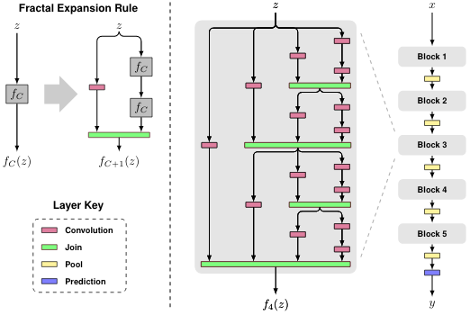

# CNN4Vision [8]

## CNN Architectures

### LeNet-5

### AlexNet

#### Architecture

#### Details/Configuration

- first use of **ReLU**
- use Norm layers
- heavy data augmentation
- dropout 0.5
- batch size 128
- SGD momentum 0.9
- Learning rate 1e-2, reduced by 10
- L2 weight decay 5e-4
- AlexNet使用了两块GTX580进行训练，其将卷积层特征映射图平分，最后将两个部分通过全连接层连接到最终输出的结果上

### VGGNet

very deep network with very small filters

#### why use smaller filters

1. stack of three 3x3 conv. layers (with stride 1) has same **effective receptive field** as one 7x7 cone. layer 
2. deeps and more non-linearities
3. fewer params in total

### GoogLeNet

- 22 layers

- efficient inception module

- no FC layers

- Only 5 million params 12x less than Alxes Net

GoogleNet构造了所谓的Inception Module的模块，其中会利用不同的滤波器（1x1、3x3、5x5以及maxpool）并行地对上一次的激活特征图进行处理，并进行串联拼接，并输出到下一层。为了减少计算代价，采用了1x1的滤波器，其保护了图像的大小，但是减少了图像的通道数。在网络中有两个额外的输出部分用于辅助分类（为较低的层增加额外的梯度）。

### ResNet

**Hypothesis: deeper models are harder to optimize**

**Solution: use network layers to fit a residual mapping instead of directly trying to fit a desired underlying mapping**

通过将输入X直接连接到几个卷积层后，挤压卷积层中残留的权重。这是因为假如我们学习到了正确的参数（恒等映射），那么这个残差应该为0，反之，我们则可以利用残差去修正这个映射。

#### Configuration

1. Batch normalization after every conv. layer
2. Xavier/2 initialization
3. SGD + momentum (0.9)
4. learning rate 0.1, divided by 10 when validation error plateaus
5. Mini-batch size 256
6. weight decay of 1e-5
7. no dropout used

### Other Architectures

#### Network in Nwrwork (NiN)

#### ResNeXt

基于ResNet提出的改进方案，将含有bottleneck layer 的模块变得更瘦，不过增加了很多的分支。

#### FractalNet: Ultra-Deep Neural Network without Residuals

不使用残差，而是构造了一种分形结构，在每个模块中构建不同深度的路径，以一种dropout的形式抛弃一些路径，从而达到降低深度的效果，同时也具有较好的性能。

#### DenseNet

在密集连接区，每一个卷积层的输出都会与后面的层进行串联拼接，这能够加强特征图的输出，有助于缓解梯度消失的现象。

